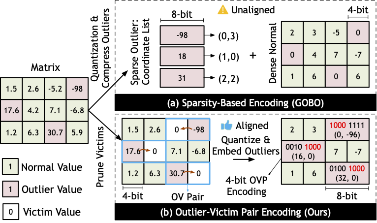

# OliVe: Accelerating Large Language Models via Hardware-friendly Outlier-Victim Pair Quantization [[paper](https://arxiv.org/abs/2304.07493)]



## Abstract

Transformer-based large language models (LLMs) have achieved great success with the growing model size. LLMs’ size grows by 240× every two years, which outpaces the hardware progress and makes model inference increasingly costly. Model quantization is a promising approach to mitigate the widening gap between LLM size and hardware capacity. However, the existence of outliers, values with significant magnitudes, in LLMs makes existing quantization methods less effective. Prior outlier-aware quantization schemes adopt sparsity encoding techniques to separate outliers from nor- mal values where the process requires global coordination (e.g., a global sparsity coordination list). This incurs complex encod- ing/decoding hardware logics and an extra orchestration controller for the computation between outlier and normal values. As such, it is not hardware-efficient and hence only achieves sub-optimal quantization benefits.

We propose OliVe, an algorithm/architecture co-designed so- lution that adopts an outlier-victim pair (OVP) quantization and handles outlier values locally with low hardware overheads and high performance gains. The key insight of OliVe is that outliers are important while the normal values next to them are not. Thus those normal values (called victims) can be sacrificed to accommodate outliers. This enables a memory-aligned OVP encoding scheme, which can be efficiently integrated to the existing hardware accel- erators like systolic array and tensor core. As a result, OliVe-based accelerator surpasses the existing outlier-aware accelerator, GOBO, by 4.5× speedup and 4.0× energy reduction, respectively, with a superior model accuracy.

## Citation
```bibtex
@article{guo2023olive,
    author = {Guo, Cong and Tang, Jiaming and Hu, Weiming and Leng, Jingwen and Zhang, Chen and Yang, Fan and Liu, Yunxin and Guo, Minyi and Zhu, Yuhao},
    title = {OliVe: Accelerating Large Language Models via Hardware-friendly Outlier-Victim Pair Quantization},
    year = {2023},
    eprint = {arXiv:2304.07493},
    doi = {10.1145/3579371.3589038},
}
```